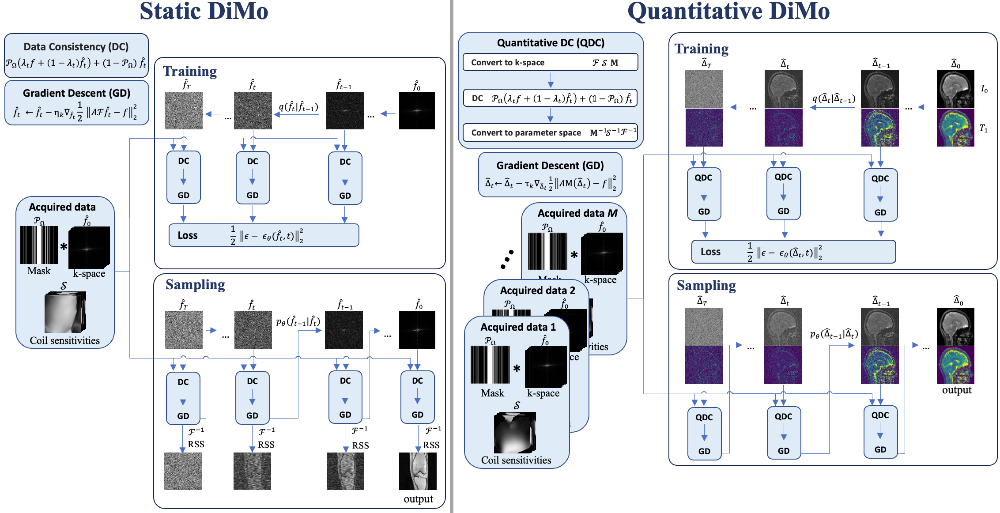
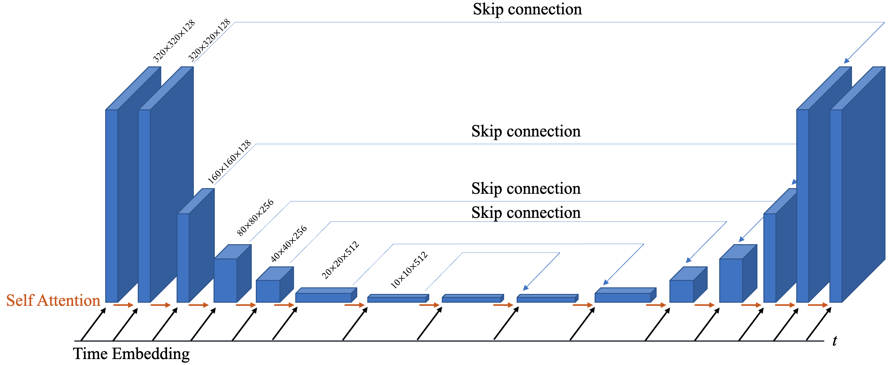

# Diffusion Model Conditioned On Native Data Domain
This is a method for image reconstruction based on a diffusion model which is conditioned on the native data domain. This method uses Denoising Diffusion Probability Model that apply to multicoil MRI and quantitative MRI reconstruction. This code is an example for single coil MRI reconstruction using diffusion model conditioned on k-space domain. 
DDPM forward and reverse processes are defined onthe native data domain rather than the image domain.This new model is applied to multi-coil static MRI andquantitative MRI reconstruction to show domain-specificadaptation.  
Gradient descent algorithm is integrated into the diffusionsteps to augment feature learning and promote efficient denoising.

The diffusion steps are learned from a Unet, this figure shows U-Net network structure used for $\epsilon_{\theta}$:

## Citation

If you find this repository useful, please cite:

**Bian, Wanyu, et al.** "Diffusion modeling with domain-conditioned prior guidance for accelerated MRI and qMRI reconstruction." *IEEE Transactions on Medical Imaging*, 2024.

